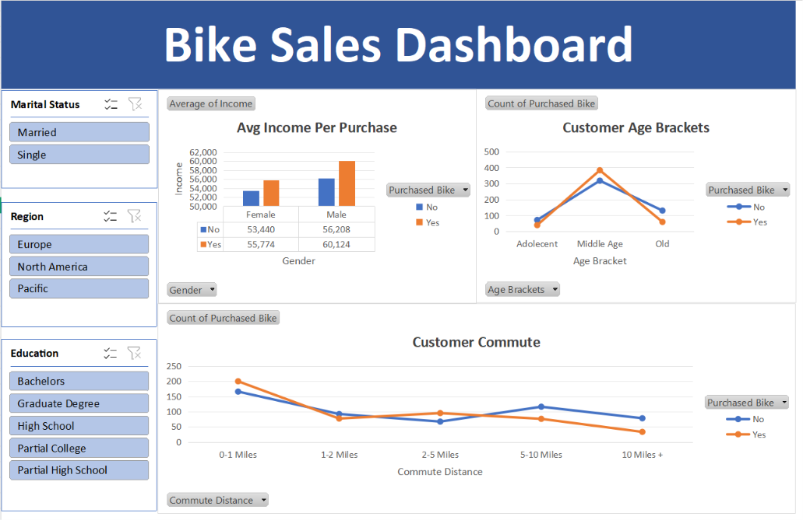

# Bike Sales Dashboard

## Project Overview

An interactive Bike Sales Dashboard developed using Microsoft Excel to analyze customer demographics, purchasing behavior, income, commute distance, education, region, and marital status.

The dashboard uses PivotTables, PivotCharts, and interactive slicers to provide insights into bike purchasing patterns.

## Dashboard Preview



## Tools & Technologies

- Microsoft Excel
- PivotTables
- PivotCharts
- Slicers
- Data Analysis
- Data Visualization

## Key Analysis

The dashboard analyzes:

- Customer income by gender and bike purchase status
- Bike purchases across different age groups
- Customer commute distance and purchasing behavior
- Bike purchases by education level
- Regional purchasing patterns
- Marital status and purchasing behavior

## Interactive Filters

Users can filter the dashboard by:

- Marital Status
- Region
- Education

## Key Insights

- Compared average income between customers who purchased bikes and those who did not.
- Analyzed purchasing patterns across Adolescent, Middle Age, and Old customer groups.
- Examined the relationship between commute distance and bike purchases.
- Identified differences in purchasing behavior across customer demographics.

## Project Structure

```text
bike-sales-dashboard/
│
├── README.md
├── Bike_Sales_Dashboard.xlsx
└── Dashboard.png
